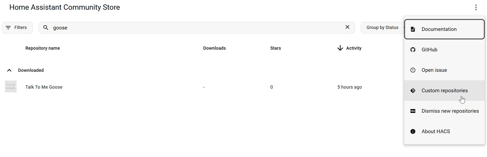

# Talk To Me Goose (Home Assistant Integration)

This is a custom integration for Home Assistant to work with [Talk To Me Goose Server](https://github.com/eslavnov/ttmg_server). 
Includes a conversation component (based on [OpenAI Conversation](https://www.home-assistant.io/integrations/openai_conversation/)) and a TTS one.

**Installation:**
1. If you are using [HACS](https://www.hacs.xyz/), you can add this repo as a custom repository with the type "Integration":
   
   Otherwise, you can manually copy `custom_components/ttgm_conversation` to your custom components folder in Home Assistant.
2. Restart Home Assistant.
3. Go to [integrations](https://my.home-assistant.io/redirect/integrations/) and search for "Talk To Me Goose Conversation". The setup and settings are mostly the same as with the original [OpenAI Conversation](https://www.home-assistant.io/integrations/openai_conversation/) integration. All these settings will be passed to your Talk To Me Goose Server.

## Change log

### v1.0.2
**Fixed**
- TTMG Server URL in the TTS component is now correctly read from the config

### v1.0.1
**Added**
- Add TTS component
- Add support for local conversation agent's responses

### v1.0.0
**Changed**
- Initial release
